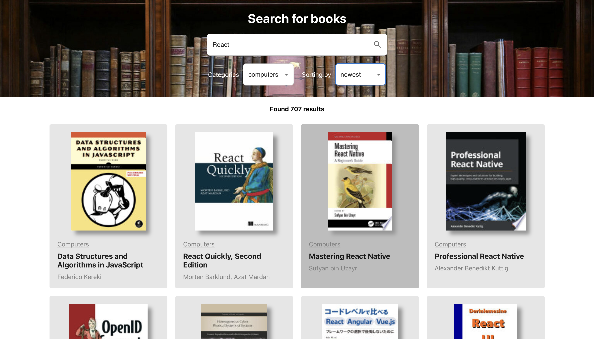

<h1>Books Finder</h1>

Find your book : https://celadon-creponne-da2728.netlify.app/

Data requested from Google Books API.
 
Test task info: https://github.com/fugr-ru/frontend-javascript-test-2
 

<h2>To build container follow next steps</h2>
run docker build -t todo-list:dev .
 
then run docker run -it --rm \
-v ${PWD}:/app \
-v /app/node_modules \
-p 3001:3000 \
-e CHOKIDAR_USEPOLLING=true \
todo-list:dev
 
app will be started on http://localhost:3001/

